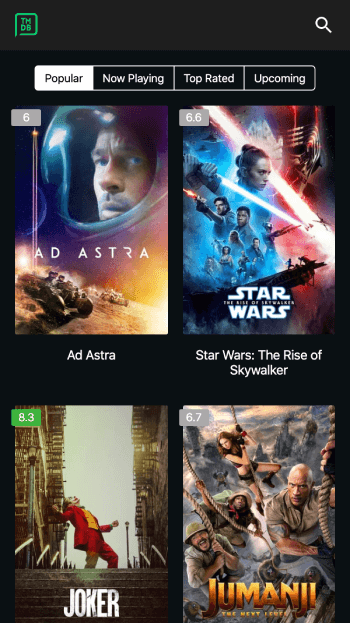

# Movies

[https://blinkcat.github.io/movies](https://blinkcat.github.io/movies)

inspired by

- [vitordino/movies](https://github.com/vitordino/movies)
- [maqsudkarimov/tmdb-app](https://github.com/maqsudkarimov/tmdb-app)
- [IvanStack/TMDb-RN-Client](https://github.com/IvanStack/TMDb-RN-Client)

powerd by

- [angular](https://github.com/angular/angular)
- [Akita](https://netbasal.gitbook.io/akita/)

api

- [TMDB](https://www.themoviedb.org/documentation/api)

[here is react version](https://blinkcat.github.io/rmovies/)
