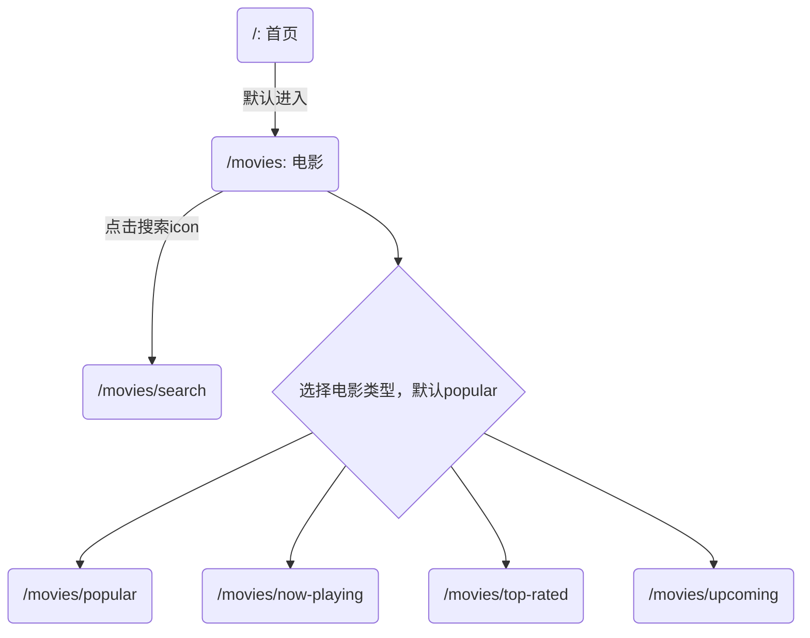

# 电影页详细设计

## usecase

1. 可以搜索电影。
2. 选择不同类型的电影。
3. 查看所选择类型的电影列表。

### 可以搜索电影

点击搜索框跳转到搜索页面。返回到首页时，首页会优先使用缓存数据。
当用户输入停止时，进行搜索。将结果显示在下方，向下滚动加载更多结果。

### 选择不同类型的电影

有以下几种类型：

1. Latest
2. Now Playing
3. Top Rated
4. Upcoming

点击不同类型，跳转到对应页面，展示不同类型的电影列表。默认选中 popular。

### 查看所选择类型的电影列表

默认展示 popular 类型电影，在选择不同类型的电影后，展示相关类型电影。缓存查询结果。
滚动到底部，加载下一页。

## url



## state

```ts
// v4
{
  // Entity Store
  movies: {
    entities: {},
    ui: {
      selected: 'popular' | 'nowPlaying' | 'topRated' | 'upcoming' | 'search'
    }
  },
  // store
  popular: {
    ids: [], // 加载下一页，就把新的 movie id 放进来。方便在 movies store 中查找。
    page: 1,
    total_pages: 12,
    total_results: 13,
    hasMore: true // page < total_pages
  },
  nowPlaying: ...
  topRated: ...
  upcoming: ...,
  // 搜索页
  'search-movie': {
    ...,
    query: '' // 当前搜索的内容
  }
}
// v3
{
  // Entity Store
  // 存储电影
  movies: {
    entities: {},
    ui: {
      selected: 'popular' | 'nowPlaying' | 'topRated' | 'upcoming'
    }
  }
  // Entity Store
  popular: {
    // key 是page，value 是相关电影id列表
    entities: {},
    page: 1,
    total_pages: 12,
    total_results: 13
  },
  // Entity Store
  nowPlaying: {},
  // Entity Store
  topRated: {},
  // Entity Store
  upcoming: {}
}
```

```ts
// v2
{
  // movie entities
  movies: {
    id: {}
  },
  popular: {
    // some movie id
    movies: [],
    page: 1,
    totalPages: 2,
    totalResults: 3
  },
  'no-playing': ...
  'top-rated': ...
  upcoming: ...,
    current:'popular'|'now-playing'|...
}
```

```ts
// v1
{
  // movie entities
  movies: {
    id: {}
  },
  selection: {
    popular: {
      // some movie id
      movies: [],
      page: 1,
      totalPages: 2,
      totalResults: 3
    },
    'no-playing': ...
    'top-rated': ...
    upcoming: ...,
    current:'popular'|'now-playing'|...
  }
}
```

## ui

1. [无限滚动](https://github.com/orizens/ngx-infinite-scroll)
2. [demo](https://movies.vitordino.com/featured)

## api

1. [tmdb](https://developers.themoviedb.org/3/movies/get-upcoming)
